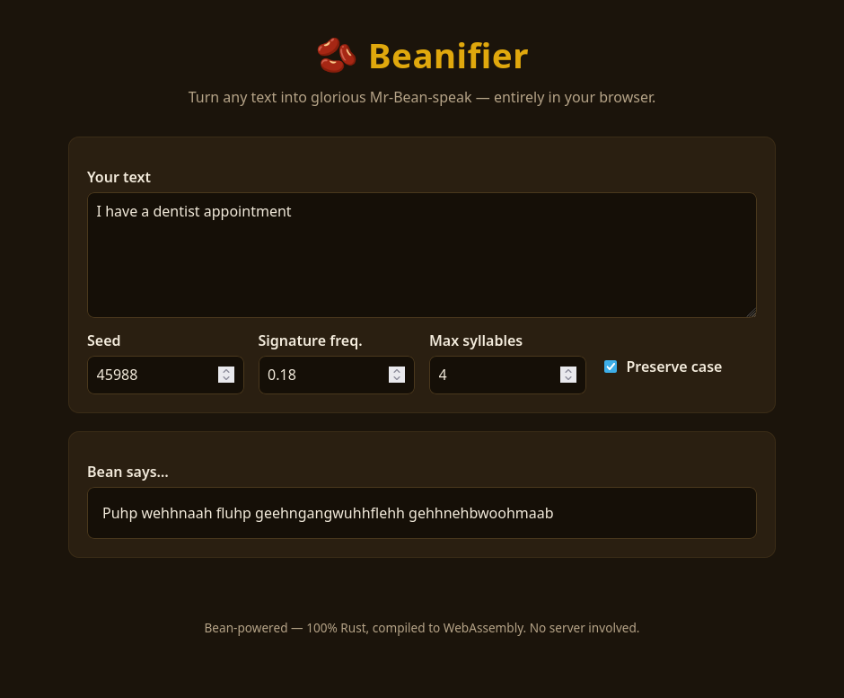

# 🫘 Beanifier

Mr-Beanify any path — file or directory, recursively — into glorious
**Mr-Bean-speak**: a stream of deterministic mumbles, grumbles, and the
occasional heartfelt *"bean"*.



```
$ echo "The quick brown fox. WOW!" > note.txt
$ beanify note.txt
Bwamhmahh ngemnginghmaam bwamhmahh nyeh daabhmoo. HMAHNEEH!
```

## What it does

Beanification is:

- **Structure preserving** — only alphanumeric runs are rewritten. Whitespace,
  punctuation, and line breaks survive verbatim, so the shape of a file (or an
  entire source tree) is retained.
- **Deterministic** — a given word under a given configuration always maps to
  the same mumble. Re-running the tool never churns unchanged files, and tests
  stay stable.
- **Case-aware** — `SHOUTING` stays shouting, `Titles` stay titled.

## Workspace layout

This is a standard Cargo workspace:

| Crate                    | Kind        | What it is                                              |
| ------------------------ | ----------- | ------------------------------------------------------- |
| `beanifier-core`         | library     | The transformation engine. No I/O; portable and pure.   |
| `beanifier-cli`          | binary+lib  | `beanify` — recursive path beanifier for the terminal.  |
| `beanifier-web`          | binary+lib  | Pure client-side WASM UI (Yew). No server.              |

```
beanifier/
├── Cargo.toml            # workspace manifest
├── crates/
│   ├── beanifier-core/   # engine + unit tests
│   ├── beanifier-cli/    # CLI (src/) + e2e tests (tests/)
│   └── beanifier-web/    # Yew WASM app (index.html + src/)
└── .github/workflows/ci.yml
```

## CLI

```
beanify [OPTIONS] <PATH>...
```

Output destinations (mutually exclusive; default is stdout):

- *(default)* — stream beanified text to stdout.
- `--in-place` — rewrite each input file in place.
- `--output <DIR>` — mirror the input tree into `<DIR>`, writing beanified
  copies (non-text files are copied verbatim).

Useful options:

- `--seed <N>` — pick a deterministic dialect of Bean-speak.
- `--signature-frequency <0.0..=1.0>` — how often a word becomes a signature
  Bean-ism (`bean`, `teddy`, …).
- `--max-syllables <N>` — cap the length of a generated mumble.
- `--no-preserve-case` — ignore the source word's casing.
- `--max-bytes <N>` — skip files larger than `N` bytes (default 5 MB).
- `--dry-run` — report what would change without writing.
- `--follow-symlinks` — follow symlinks while walking.

Examples:

```sh
# Beanify a single file to your terminal
beanify README.md

# Beanify a whole tree in place (careful!)
beanify --in-place ./docs

# Beanify a tree into a fresh copy, leaving the original untouched
beanify --output ./beanified ./src
```

## Web frontend

The frontend is written **entirely in Rust** and runs **entirely in the
browser** as WebAssembly via [Yew](https://yew.rs). There is **no server**: the
beanifier engine is compiled to `wasm32` and re-runs locally on every keystroke.
The build is a static bundle you can host on any file server (or GitHub Pages).

```sh
just web-serve   # live-reload dev server (installs trunk + wasm target if needed)
just web-build   # static release bundle → crates/beanifier-web/dist/
```

Both recipes bootstrap [`trunk`](https://trunkrs.dev) (the WASM bundler) and the
`wasm32-unknown-unknown` target on first run.

## Development

```sh
just build   # build the whole workspace
just test    # run all tests
just lint    # cargo clippy --workspace --all-targets
just fmt     # cargo fmt --all
```

## License

MIT — see [LICENSE](LICENSE).
